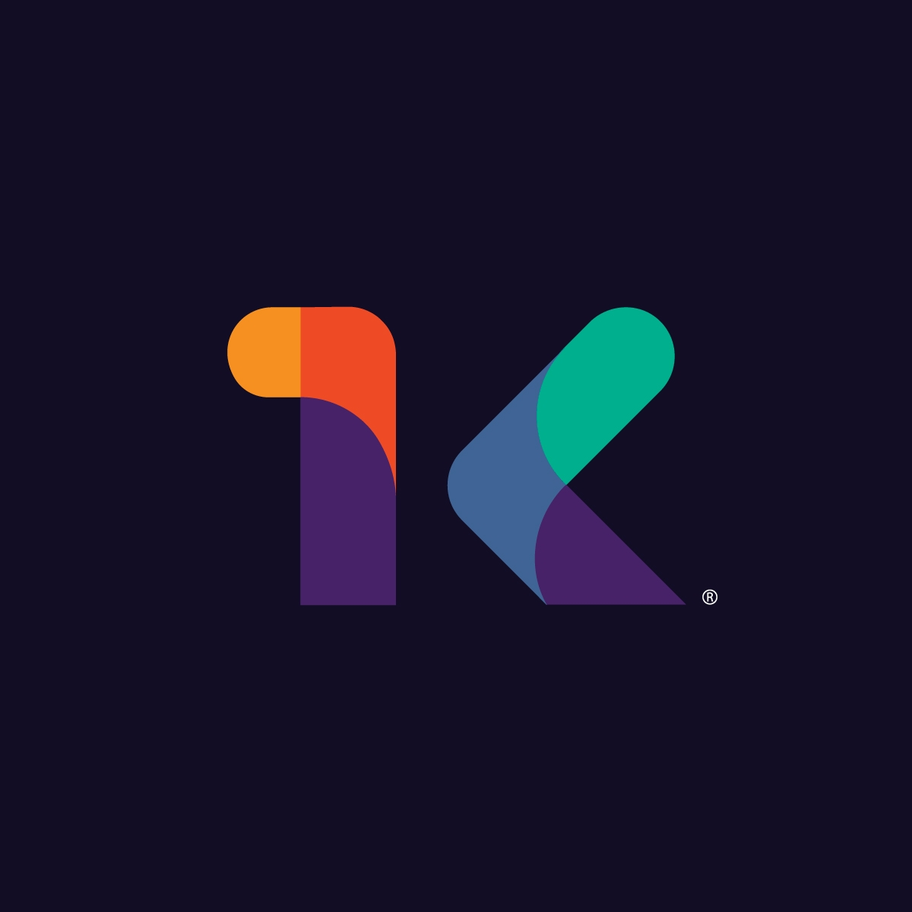

# 💻 KODIGO 💻

### Acerca de Nosotros

<h3>🎉🎊 Transformando vidas a través del código 🎊🎉</h3>

KODIGO Coding Academy es un proyecto diseñado y creado por la organización sin fines de lucro "Parrandear para Dar". Nuestro objetivo principal es transformar las vidas de jóvenes en riesgo en El Salvador mediante la creación de un ecosistema de talento en programación que beneficie y transforme las vidas de estos individuos y sus comunidades.

### 🌟 Nuestro Propósito 🌟

Aumentar las oportunidades de inclusión social para jóvenes de alto rendimiento y escasos recursos, otorgando becas para desarrollar habilidades técnicas de programación y habilidades blandas que mejorarán sus trayectorias profesionales y transformarán sus vidas.

### 💎 Nuestros Valores 💎

- **✨ Respeto** - Tratamos a todos con dignidad y valoramos las perspectivas diversas
- **🤝 Integridad** - Actuamos con honestidad y nos adherimos a principios éticos
- **💡 Creatividad** - Fomentamos el pensamiento innovador y las soluciones únicas
- **🔄 Innovación** - Evolucionamos continuamente nuestros métodos de enseñanza y planes de estudio
- **😊 Alegría** - Aportamos entusiasmo y positividad a la experiencia de aprendizaje

### 🛠️ Lo Que Enseñamos 🛠️

Nos especializamos en educación integral de desarrollo de software, incluyendo:

- 🔙 Desarrollo Back-End
- 🖥️ Desarrollo Front-End
- 🎨 Desarrollo Multimedia
- 📱 Desarrollo Móvil
- 💻 Programación Informática
- ⚡ Desarrollo Full Stack

### 📂 Nuestros Proyectos 📂

Esta organización de GitHub alberga proyectos desarrollados por nuestros estudiantes, materiales de enseñanza e iniciativas colaborativas. Siéntase libre de explorar nuestros repositorios para ver el impacto de nuestro trabajo.

### 🤝 Cómo Participar 🤝

- **👨‍🏫 Mentoría a nuestros estudiantes**: Comparta su experiencia con la próxima generación de desarrolladores
- **🧩 Contribuya a nuestros proyectos**: Ayúdenos a construir herramientas para la educación
- **💰 Done**: Apoye nuestros programas de becas para jóvenes
- **🌱 Contrate a nuestros graduados**: Brinde oportunidades a nuestros talentosos alumnos

## 📞 Conéctese Con Nosotros 📞

- **🌐 Sitio web**: [https://www.kodigo.org](https://www.kodigo.org)
- **👥 LinkedIn**: [KODIGO Coding Academy](https://www.linkedin.com/company/kod1go/about/)
- **📱 Facebook**: [KODIGO](https://www.facebook.com/KODIGO.ORG/)

---

  
© 2017-2025 KODIGO Coding Academy. Todos los derechos reservados.

  
"Transformando vidas a través del código desde 2017"

